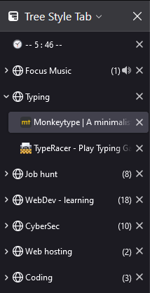

# x-lessthan-30
Quick and simple projects that are actually useful. Built in under 30 minutes

## Separator and timer 

- **Separator** is a small enhancement to [Tree Style Tab](https://github.com/piroor/treestyletab/blob/trunk/README.md) in form of a tab to allow grouping and set title of the group.

! Security risk ! - input not sanitised.

- **Timer** another enhancement in form of a tab to allow a working timer to be displayed in title. Similar to google timer, without bloat.
